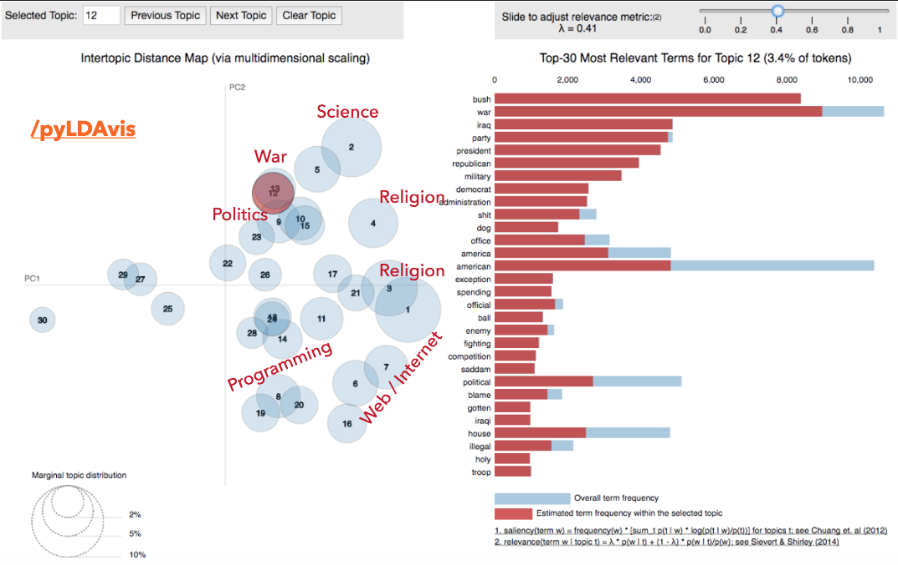

# NLP - Reddit user Analytics 
### Using NLP to cluster reddit user comments by topics  
My goal for this project was to apply NLP techniques I recently acquired. I wanted to create a tool which analyzes a media platform on a macro level to see what people are/were talking about. Since there is a huge amount of Reddit data available online as zip files I used a portion of this data amounting to about 15 million user comments (2005-2012). I dumped all this data into a MongoDB and used AWS to process, prepare and modeled my data. Precisely, I created a pipeline to clean the user comments with NLTK, create a matrix of the term frequency–inverse document frequency features and used Latent Dirichlet Allocation for clustering topics. LDA is a model that makes it possible to look at each document/user comment as a combination of a number of different topics. Each word of the document is assignable to one of the document's topics.
Some of the major topics that were found are:  
- Politics, War, Programming, Internet, Religion  
- Election / voting, Life/Family, Globalism, Economy, Science  

After looking at every user's main topics I created a web application with which you can find out new suggestions for connections and topics for an individual user.  

Short summary:  
- Data used for this project: 25GB of reddit text data / 15 million comments  
Objectives:  
- Create a tool to summarize user activities using NLP  
- Topics of interest  
- Connection to users with similar interest  
- Suggestions for new connections and topics  
  
Tools used for storage, processing, visualizations:  
- MongoDB  
- AWS  
- D3, Flask  
  
Data Exploring / Topic Modeling:  
- Text cleaning with NLTK  
- Count / TFIDF Vectorizer  
- LSA / SVD  
- LDA  
  

